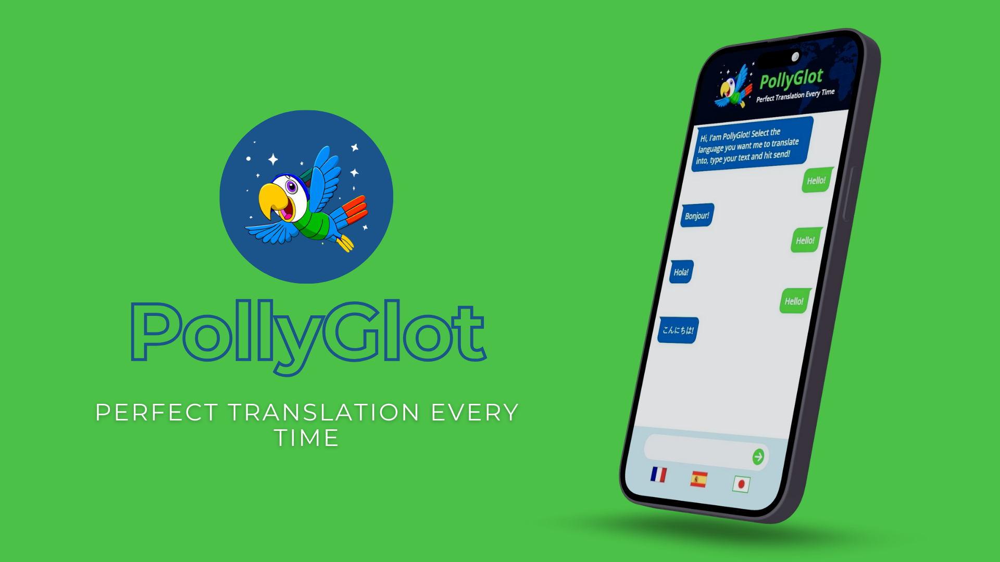
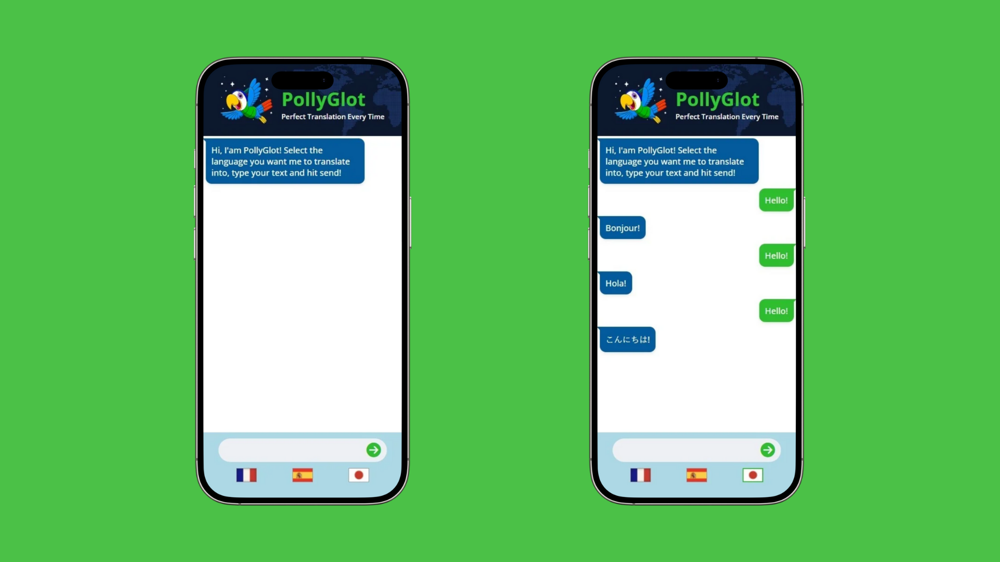
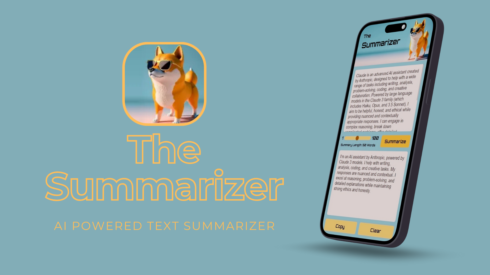
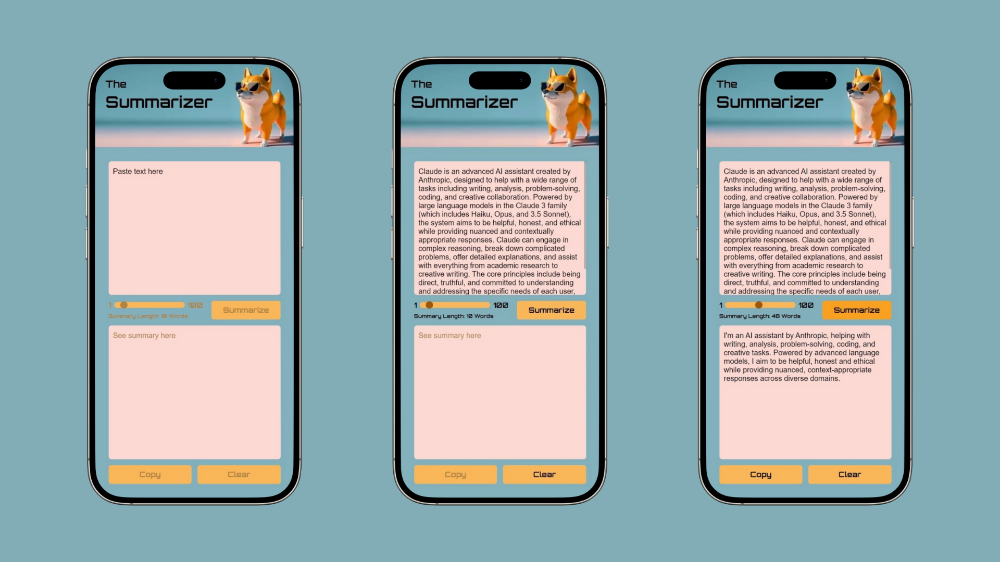
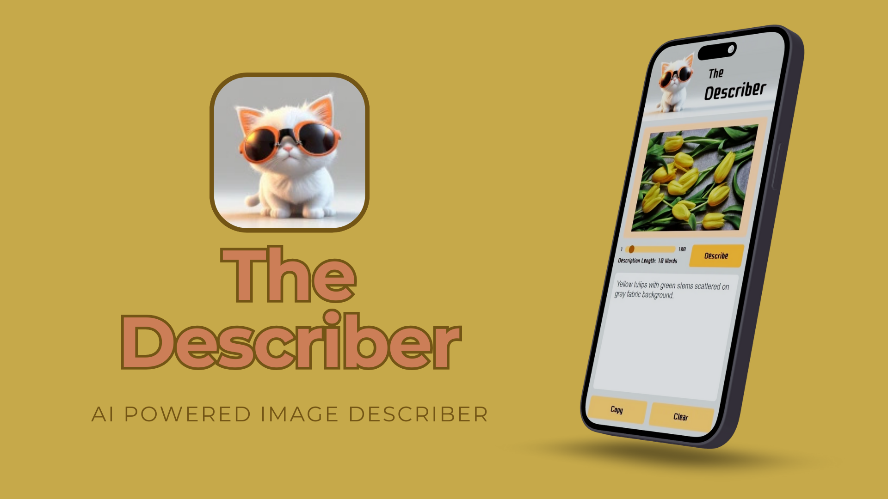
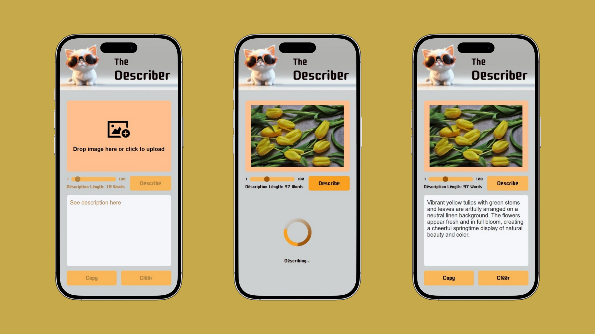

# AI-Experiments

## OpenAI API
- [PolyGlot](https://polly-glot.pages.dev/)

## Anthropic Claude
- [Text Summarizer](https://the-summarizer-app.pages.dev/)

- [Image Describer](https://image-describer-app.pages.dev/)

## AI Image Generation
- [AI Photo Gallery](https://ai-photo-gallery-by-s4ch1.netlify.app/)

## Official Documentation

<a href="https://platform.openai.com/docs/concepts">OpenAI API</a>

<a href="https://docs.anthropic.com/en/home">Build with Claude</a>

